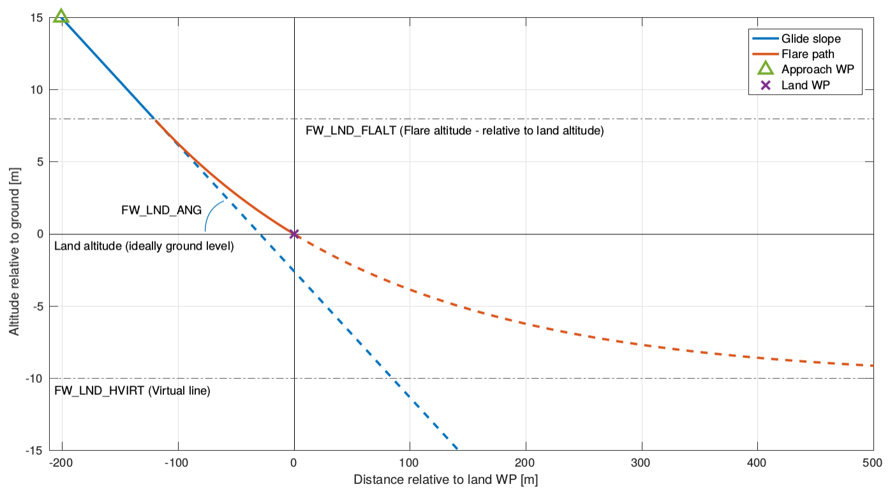
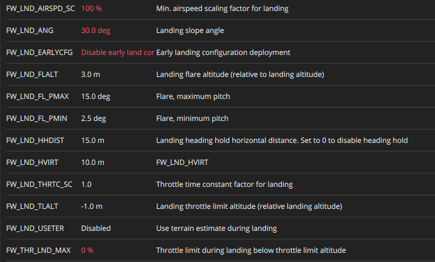
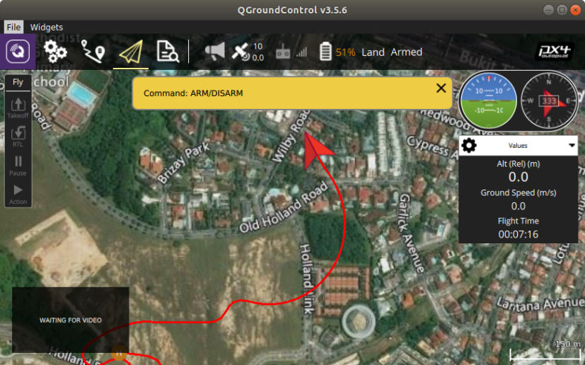
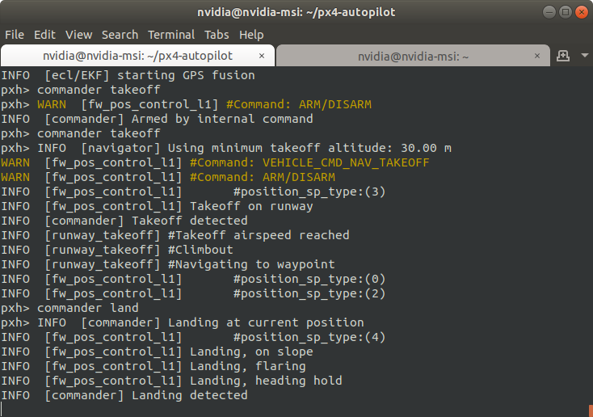
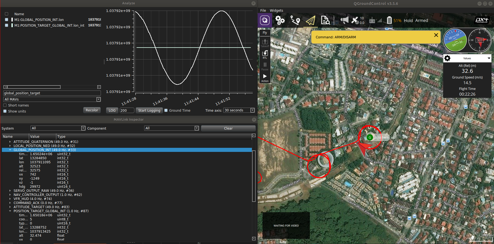

## Overview
:::note
The overview can be seen in `PX4.io` official documentation on `Fixed Wing Landing` and the documentation can be found [here](https://docs.px4.io/v1.12/en/flying/fixed_wing_landing.html) 
:::

PX4 enables **autopilot-controlled fixed-wing (FW) landing** in **Missions** mode, **Land** mode and **Return** mode.

The landing logic has several phases, as shown below. In the first phase the vehicle will follow a fixed trajectory (**FW_LND_ANG**) towards the ground. At the flare landing altitude (**FW_LND_FLALT**) the vehicle will start to follow a flare path (the curve is based on the value of **FW_LND_HVIRT**).



The flare landing altitude is relative to the altitude that the FW vehicle "**thinks**" is ground level. In **Land mode** the ground altitude is not known and the vehicle will use assume it is at 0m (**sea level**). Often the ground level will be much higher than sea level, so the vehicle will land in the **first phase** (**it will land on the ground before it reaches the flare altitude**).


| Parameter     | Description | 
| :---:       |    :----:   | 
| **<font color='LightGreen'> FW_LND_ANG </font>**  | Landing slope angle prior to flaring | 
| **<font color='LightGreen'> FW_LND_HVIRT </font>**  | Virtual horizontal line/altitude used to calculate the flare trajectory. This represents the sub-ground altitude that the flare-path curve asymptotically approaches. | 
| **<font color='LightGreen'> FW_LND_HVIRT </font>**  | Virtual horizontal line/altitude used to calculate the flare trajectory. This represents the sub-ground altitude that the flare-path curve asymptotically approaches. | 
| **<font color='LightGreen'> FW_LND_FLALT </font>** |	Landing flare altitude (relative to landing altitude)|
| **<font color='LightGreen'> FW_LND_TLALT </font>** |	Landing throttle limit altitude (relative landing altitude). The default value of -1.0 lets the system default to applying throttle limiting at 2/3 of the flare altitude. |
| **<font color='LightGreen'> FW_LND_HHDIST </font>**  | Landing heading hold horizontal distance |
| **<font color='LightGreen'> FW_LND_USETER </font>**  |	Use terrain estimate (ground altitude from GPS) during landing. This is turned off by default and a waypoint or return altitude is normally used (or sea level for an arbitrary land position). |   
| **<font color='LightGreen'> FW_LND_FL_PMIN </font>**  |	Minimum pitch during flare. A positive sign means nose up Applied once FW_LND_TLALT is reached |
| **<font color='LightGreen'> FW_LND_FL_PMAX </font>**  |	Maximum pitch during flare. A positive sign means nose up Applied once FW_LND_TLALT is reached |
| **<font color='LightGreen'> FW_LND_AIRSPD_SC </font>** |	Min. airspeed scaling factor for landing. Comment: Multiplying this factor with the minimum airspeed of the plane gives the target airspeed the landing approach. `FW_AIRSPD_MIN x FW_LND_AIRSPD_SC` |

Sample values for FW with changed values being highlighted in **<font color='red'> RED </font>** :

||
|----|

## Code Review

Function in `FixedwingPositionControl.cpp`, this is called when `commander land` is used in the **mav console** which will switch the `position_sp_type` to **4** which refers to `SETPOINT_TYPE_LAND (4)` where default is **2** `SETPOINT_TYPE_LOITER (2)`. This is becasue the UAV is always going to loiter around the waypoint. you can find the different modes under the UORB message `position_setpoint`.
```cpp
void
FixedwingPositionControl::control_landing(
    const hrt_abstime &now, 
    const Vector2d &curr_pos,
	const Vector2f &ground_speed, 
    const position_setpoint_s &pos_sp_prev, 
    const position_setpoint_s &pos_sp_curr)
```
## Findings

- Apparently after checking normally `!pos_sp_prev.valid` meaning that there is no `pos_sp.valid` and the current `lat` and `long` is used as the `prev_wp`

- There is a flaw in the landing logic, where the bearing is locked, and the roll and yaw control is locked as it descends, since it takes `Vector2d curr_wp(pos_sp_curr.lat, pos_sp_curr.lon);` the current waypoint to be its one position, not the next setpoint that was given (**this has to be changed!**)

|         |         |
| ------------ | ------------- |

- The mavlink command from QGC is sent to `POSITION_TARGET_GLOBAL_INT` and it is under the `.lat_int`, `lon_int` and `alt` and the current position is under `GLOBAL_POSITION_INT` and the values for latitude, longitude and altitude is `lat`, `lon` and `alt`.

|         |
| ------------ |

- After sending `commander land` the `NAV_CONTROLLER_OUTPUT.wp_dist` = 0 since it assumes the current position is the current waypoint, we need to implement the UAV to land with a specific global coordinates.  

- The `Heading Hold` is activated after `Flare` hence the height is according to the `FW_LND_FLALT` height.

- `getLandingSlopeRelativeAltitudeSave` only activates and **returns** the **slope altitude** when the current bearing is close to the final bearing (**desired**)

## Initialization
The start of the function is to initialise the start and end points for the landing maneuver, the start would be the current position if `!pos_sp_prev.valid` and will use the current `longitude` and `latitude`


```cpp
/* current waypoint (the one currently heading for) */
Vector2d curr_wp(pos_sp_curr.lat, pos_sp_curr.lon);
Vector2d prev_wp{0, 0}; /* previous waypoint */

if (pos_sp_prev.valid) {
    prev_wp(0) = pos_sp_prev.lat;
    prev_wp(1) = pos_sp_prev.lon;

} else {
    /*
    * No valid previous waypoint, go for the current wp.
    * This is automatically handled by the L1 library.
    */
    prev_wp(0) = pos_sp_curr.lat;
    prev_wp(1) = pos_sp_curr.lon;
}
```

### Constrain TECS
The TECS would have a higher `_height_error_gain`, this is to have the UAV maintain the altitude on the course that PX4 has desired `_height_error_gain = 1.0f / math::max(time_const, 0.1f)`.
```cpp
// Enable tighter altitude control for landings
_tecs.set_height_error_time_constant(_param_fw_thrtc_sc.get() * _param_fw_t_h_error_tc.get());
```

### Reset Logical States
We need to reset some of the logical states that help to govern the landing process
```cpp
// _time_started_landing = 0;

// reset terrain estimation relevant values
// _time_last_t_alt = 0;
// _land_noreturn_horizontal = false;
// _land_noreturn_vertical = false;
// _land_stayonground = false;
// _land_motor_lim = false;
// _land_onslope = false;
reset_landing_state();
_time_started_landing = now;
```

### Heading
Also we have to change the **bearing** of the airplane to face the bearing of the landing point `bearing_lastwp_currwp`. 
```cpp
const float bearing_airplane_currwp = get_bearing_to_next_waypoint(
    (double)curr_pos(0), 
    (double)curr_pos(1),
    (double)curr_wp(0), 
    (double)curr_wp(1));
float bearing_lastwp_currwp = bearing_airplane_currwp;
// seems like the value is overwritten if there is a valid previous waypoint
if (pos_sp_prev.valid) {
    bearing_lastwp_currwp = get_bearing_to_next_waypoint(
        (double)prev_wp(0), 
        (double)prev_wp(1), 
        (double)curr_wp(0),
        (double)curr_wp(1));
}
```

### Find Seperation Distance
Finding the distance to calculate for, which is the seperation distance.
```cpp
/* Horizontal landing control */
/* switch to heading hold for the last meters, continue heading hold after */
float wp_distance = get_distance_to_next_waypoint(
    (double)curr_pos(0), 
    (double)curr_pos(1), 
    (double)curr_wp(0),
	(double)curr_wp(1));

/* calculate a waypoint distance value which is 0 when the aircraft is behind the waypoint */
float wp_distance_save = wp_distance;

if (fabsf(wrap_pi(bearing_airplane_currwp - bearing_lastwp_currwp)) >= radians(90.0f)) {
    wp_distance_save = 0.0f;
}
```

### Find Waypoint Offset
This is a helpful function to create a waypoint to track (**virtual final destination**), the plane will use the `pos_sp_prev` (if valid) to the `pos_sp_curr` 

- Hence if we do not have `pos_sp_prev` and `pos_sp_curr`, the default is `pos_sp_prev = pos_sp_curr = current position`

```cpp
// create virtual waypoint which is on the desired flight path but
// some distance behind landing waypoint. This will make sure that the plane
// will always follow the desired flight path even if we get close or past
// the landing waypoint
if (pos_sp_prev.valid) {
    double lat = pos_sp_curr.lat;
    double lon = pos_sp_curr.lon;

    create_waypoint_from_line_and_dist(
        pos_sp_curr.lat,
        pos_sp_curr.lon,
        pos_sp_prev.lat,
        pos_sp_prev.lon,
        -1000.0f, &lat, &lon);

    curr_wp(0) = lat;
    curr_wp(1) = lon;
}
```
### Heading Hold on Condition
Tracking the desired flight path until UAV starts flaring, hence the bearing is not held until **4** conditions are stisfied according to PX4
- `_param_fw_lnd_hhdist.get() > 0.0f`
- `!_land_noreturn_horizontal`
- `((wp_distance < _param_fw_lnd_hhdist.get()) ||_land_noreturn_vertical))`

**The Heading Hold is activated after Flare**
:::note
- `_param_fw_lnd_hhdist.get()` or `FW_LND_HHDIST` = **15m** (default value)
- `FW_LND_FLALT` or flare altitude = **3m** (default value)
- `_land_noreturn_vertical` is activate when flaring phase just starts
:::

```cpp
// we want the plane to keep tracking the desired flight path until we start flaring
// if we go into heading hold mode earlier then we risk to be pushed away from the runway by cross winds
if ((_param_fw_lnd_hhdist.get() > 0.0f) &&
!_land_noreturn_horizontal &&
((wp_distance < _param_fw_lnd_hhdist.get()) ||
_land_noreturn_vertical)) {

    if (pos_sp_prev.valid) {
        /* heading hold, along the line connecting this and the last waypoint */
        _target_bearing = bearing_lastwp_currwp;

    } else {
        _target_bearing = _yaw;
    }

    _land_noreturn_horizontal = true;
    mavlink_log_info(&_mavlink_log_pub, "Landing, heading hold");
}

if (_land_noreturn_horizontal) {
    // heading hold
    _l1_control.navigate_heading(_target_bearing, _yaw, ground_speed);

} else {
    // normal navigation
    _l1_control.navigate_waypoints(prev_wp, curr_wp, curr_pos, ground_speed);
}

_att_sp.roll_body = _l1_control.get_roll_setpoint();
_att_sp.yaw_body = _l1_control.nav_bearing();

if (_land_noreturn_horizontal) {
    /* limit roll motion to prevent wings from touching the ground first */
    /* Limit to 10 degs */
    _att_sp.roll_body = constrain(_att_sp.roll_body, radians(-10.0f), radians(10.0f));
}
```

### Set Terrain Altitude

The terrain is initialised to help tell TECS and the controller what is the height difference, the logical sequence here is valid for **terrain sensor (range sensors)**
```cpp
// default to no terrain estimation, just use landing waypoint altitude
float terrain_alt = pos_sp_curr.alt;

if (_param_fw_lnd_useter.get() == 1) {
    if (_local_pos.dist_bottom_valid) {
        // all good, have valid terrain altitude
        float terrain_vpos = _local_pos.dist_bottom + _local_pos.z;
        terrain_alt = (_local_pos.ref_alt - terrain_vpos);
        _t_alt_prev_valid = terrain_alt;
        _time_last_t_alt = now;

    } else if (_time_last_t_alt == 0) {
        // we have started landing phase but don't have valid terrain
        // wait for some time, maybe we will soon get a valid estimate
        // until then just use the altitude of the landing waypoint
        if ((now - _time_started_landing) < 10_s) {
            terrain_alt = pos_sp_curr.alt;

        } else {
            // still no valid terrain, abort landing
            terrain_alt = pos_sp_curr.alt;
            abort_landing(true);
        }

    } else if ((!_local_pos.dist_bottom_valid && (now - _time_last_t_alt) < T_ALT_TIMEOUT)
            || _land_noreturn_vertical) {
        // use previous terrain estimate for some time and hope to recover
        // if we are already flaring (land_noreturn_vertical) then just
        //  go with the old estimate
        terrain_alt = _t_alt_prev_valid;

    } else {
        // terrain alt was not valid for long time, abort landing
        terrain_alt = _t_alt_prev_valid;
        abort_landing(true);
    }
}
```

## Controls

### FW Descend

We will evaluate the `else` portion which is the descending of the UAV, following what PX4 has mentioned about unwanted climbout (`checking for land_noreturn to avoid unwanted climb out`).

- `altitude_desired = terrain_alt + landing_slope_alt_rel_desired;` ensures the UAV stays on the slope.
- After which `_land_onslope = true` and the UAV will follow the altitude desired for the next timestep and this will be passed to the **TECS controller**

- `tecs_update_pitch_throttle()` will publish `_tecs_status_pub.publish(t)` so tecs will control **pitch** and **throttle**.

- `wp_distance` distance from current to final waypoint.

```cpp
if ((_current_altitude < terrain_alt + _landingslope.flare_relative_alt()) ||
    _land_noreturn_vertical) {  //checking for land_noreturn to avoid unwanted climb out
    } else {

    /* intersect glide slope:
        * minimize speed to approach speed
        * if current position is higher than the slope follow the glide slope (sink to the
        * glide slope)
        * also if the system captures the slope it should stay
        * on the slope (bool land_onslope)
        * if current position is below the slope continue at previous wp altitude
        * until the intersection with slope
        * */

    float altitude_desired = terrain_alt;

    const float landing_slope_alt_rel_desired = _landingslope.getLandingSlopeRelativeAltitudeSave(
        wp_distance,
        bearing_lastwp_currwp, 
        bearing_airplane_currwp);

    if (_current_altitude > terrain_alt + landing_slope_alt_rel_desired || _land_onslope) {
        /* stay on slope */
        altitude_desired = terrain_alt + landing_slope_alt_rel_desired;

        if (!_land_onslope) {
            mavlink_log_info(&_mavlink_log_pub, "Landing, on slope");
            _land_onslope = true;
        }

    } else {
        /* continue horizontally */
        if (pos_sp_prev.valid) {
            altitude_desired = pos_sp_prev.alt;

        } else {
            altitude_desired = _current_altitude;
        }
    }

    const float airspeed_approach = _param_fw_lnd_airspd_sc.get() * _param_fw_airspd_min.get();

    tecs_update_pitch_throttle(
        now,
        altitude_desired,
        calculate_target_airspeed(airspeed_approach, ground_speed),
        radians(_param_fw_p_lim_min.get()),
        radians(_param_fw_p_lim_max.get()),
        _param_fw_thr_min.get(),
        _param_fw_thr_max.get(),
        _param_fw_thr_cruise.get(),
        false,
        radians(_param_fw_p_lim_min.get()));
    }
``` 
### FW Flare

Condition to activate flare is `(_current_altitude < terrain_alt + _landingslope.flare_relative_alt())` this is when the current altitude low enough to activate the flare which is around `FW_LND_FLALT` height.


```cpp
    if ((_current_altitude < terrain_alt + _landingslope.flare_relative_alt()) ||
    _land_noreturn_vertical) {
    /* land with minimal speed */

    /* force TECS to only control speed with pitch, altitude is only implicitly controlled now */
    // _tecs.set_speed_weight(2.0f);

    /* kill the throttle if param requests it */
    float throttle_max = _param_fw_thr_max.get();

    /* enable direct yaw control using rudder/wheel */
    if (_land_noreturn_horizontal) {
        _att_sp.yaw_body = _target_bearing;
        _att_sp.fw_control_yaw = true;
    }

    if (((_current_altitude < terrain_alt + _landingslope.motor_lim_relative_alt()) &&
            (wp_distance_save < _landingslope.flare_length() + 5.0f)) || // Only kill throttle when close to WP
        _land_motor_lim) {
        throttle_max = min(throttle_max, _param_fw_thr_lnd_max.get());

        if (!_land_motor_lim) {
            _land_motor_lim  = true;
            mavlink_log_info(&_mavlink_log_pub, "Landing, limiting throttle");
        }
    }

    float flare_curve_alt_rel = _landingslope.getFlareCurveRelativeAltitudeSave(wp_distance, bearing_lastwp_currwp,
                    bearing_airplane_currwp);

    /* avoid climbout */
    if ((_flare_curve_alt_rel_last < flare_curve_alt_rel && _land_noreturn_vertical) || _land_stayonground) {
        flare_curve_alt_rel = 0.0f; // stay on ground
        _land_stayonground = true;
    }

    const float airspeed_land = _param_fw_lnd_airspd_sc.get() * _param_fw_airspd_min.get();
    const float throttle_land = _param_fw_thr_min.get() + (_param_fw_thr_max.get() - _param_fw_thr_min.get()) * 0.1f;

    tecs_update_pitch_throttle(
        now,
        terrain_alt + flare_curve_alt_rel,
        calculate_target_airspeed(airspeed_land, ground_speed),
        radians(_param_fw_lnd_fl_pmin.get()),
        radians(_param_fw_lnd_fl_pmax.get()),
        0.0f,
        throttle_max,
        throttle_land,
        false,
        _land_motor_lim ? radians(_param_fw_lnd_fl_pmin.get()) : radians(_param_fw_p_lim_min.get()),
        _land_motor_lim ? tecs_status_s::TECS_MODE_LAND_THROTTLELIM : tecs_status_s::TECS_MODE_LAND);

    if (!_land_noreturn_vertical) {
        // just started with the flaring phase
        _flare_pitch_sp = radians(_param_fw_psp_off.get());
        _flare_height = _current_altitude - terrain_alt;
        mavlink_log_info(&_mavlink_log_pub, "Landing, flaring");
        _land_noreturn_vertical = true;

    } else {
        if (_local_pos.vz > 0.1f) {
            _flare_pitch_sp = radians(_param_fw_lnd_fl_pmin.get()) *
            constrain((_flare_height - (_current_altitude - terrain_alt)) / _flare_height, 0.0f, 1.0f);
        }

        // otherwise continue using previous _flare_pitch_sp
    }

    _att_sp.pitch_body = _flare_pitch_sp;
    _flare_curve_alt_rel_last = flare_curve_alt_rel;
    }
```

## Helper Functions
`get_bearing_to_next_waypoint` can be found in the `geo.cpp` under `ecl/geo.cpp`
```cpp
float get_bearing_to_next_waypoint(double lat_now, double lon_now, double lat_next, double lon_next)
{
	const double lat_now_rad = math::radians(lat_now);
	const double lat_next_rad = math::radians(lat_next);

	const double cos_lat_next = cos(lat_next_rad);
	const double d_lon = math::radians(lon_next - lon_now);

	/* conscious mix of double and float trig function to maximize speed and efficiency */

	const float y = static_cast<float>(sin(d_lon) * cos_lat_next);
	const float x = static_cast<float>(cos(lat_now_rad) * sin(lat_next_rad) - sin(lat_now_rad) * cos_lat_next * cos(d_lon));

	return wrap_pi(atan2f(y, x));
}
```

`wrap_pi` can be found in the `matrix/matrix/helper_functions.hpp`
```cpp
#define M_PI 3.14159265358979323846
/**
 * Wrap value in range [-π, π)
 */
template<typename Type>
Type wrap_pi(Type x)
{
    return wrap(x, Type(-M_PI), Type(M_PI));
}
```

`getLandingSlopeRelativeAltitudeSave` can be found in the directory `landing_slope/Landingslope.cpp`
```cpp
float
Landingslope::getLandingSlopeRelativeAltitudeSave(
    float wp_landing_distance, 
    float bearing_lastwp_currwp,
	float bearing_airplane_currwp)
{
	/* If airplane is in front of waypoint return slope altitude, else return waypoint altitude */
	if (fabsf(matrix::wrap_pi(bearing_airplane_currwp - bearing_lastwp_currwp)) < math::radians(90.0f)) {
		return getLandingSlopeRelativeAltitude(wp_landing_distance);

	}

	return 0.0f;
}
```

`getLandingSlopeRelativeAltitude` can be found in the directory `landing_slope/Landingslope.cpp`
```cpp
/**
 *
 * @return Relative altitude of point on landing slope at distance to landing waypoint=wp_landing_distance
 */
float Landingslope::getLandingSlopeRelativeAltitude(float wp_landing_distance, float horizontal_slope_displacement,
		float landing_slope_angle_rad)
{
	// flare_relative_alt is negative
	return (wp_landing_distance - horizontal_slope_displacement) * tanf(landing_slope_angle_rad);
}
```