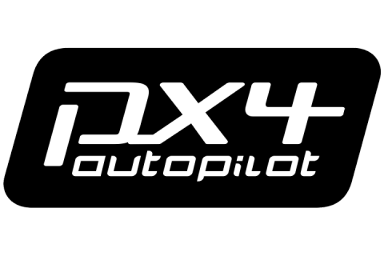

## Overview

||
|----|

PX4 is a autopilot software stack. An **[open source repository](https://github.com/PX4/PX4-Autopilot)**, and supported by an active world wide community, it powers all kinds of vehicles from racing and cargo drones through to ground vehicles and submersibles.

PX4 Official documentations can be found over at this website ([here](https://docs.px4.io/master/en/))